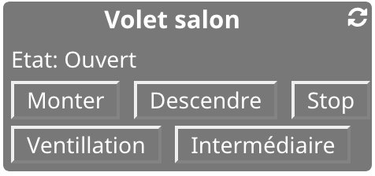
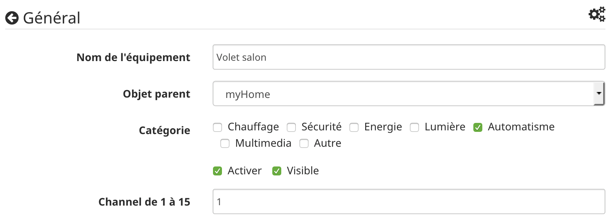

Présentation
============

**Le plugin Eleroha** interface les stores équipés d'un système Elero avec Jeedom.

**Prérequis**

>Pour fonctionner, Eleroha nécessite un stick USB Elero afin d'assurer la communication entre Jeedom et vos équipements Elero.

Aussi, vous devez préhalablement :
1. Associer vos stores Elero avec le stick USB comme cela est décrit dans la documentation Elero.
Vous noterez les channels qui correspondent à vos stores. Cette information vous sera demandée lors de la création de vos équipements dans Jeedom.
2. Placer le stick USB dans un port USB libre de votre box Jeedom

Les principales fonctionnalités de Eleroha sont :

**Le pilotage**

>Eleroha vous permet de monter, descendre, stopper, placer en position ventillation vos stores.

**Le monitoring**

>Eleroha vous indique la postion courante de vos stores

**Le widget Eleroha**

**Activation et configuration**

>Après avoir activé le plugin il est indspensble de :
1. Sélectionner port du stick USB Elero,
2. Saisir le port 55030.

N'oubliez pas de sauvegarder.

**Création de votre équipement**

>Après avoir nommé l'équipement, saisissez le numéro du channel qui correspond à votre store.
Les channels sont numérotés de 1 à 15.
Le channel correspond à celui que vous avez associé avec votre store lors de l'étape de configuration du stick USB Elero.

N'oubliez pas de sauvegarder !

Félicitation, vous avez terminé.

Vous pouvez actualiser manuellement les informations en cliquant sur l'icone située en haut à droite du widget.
